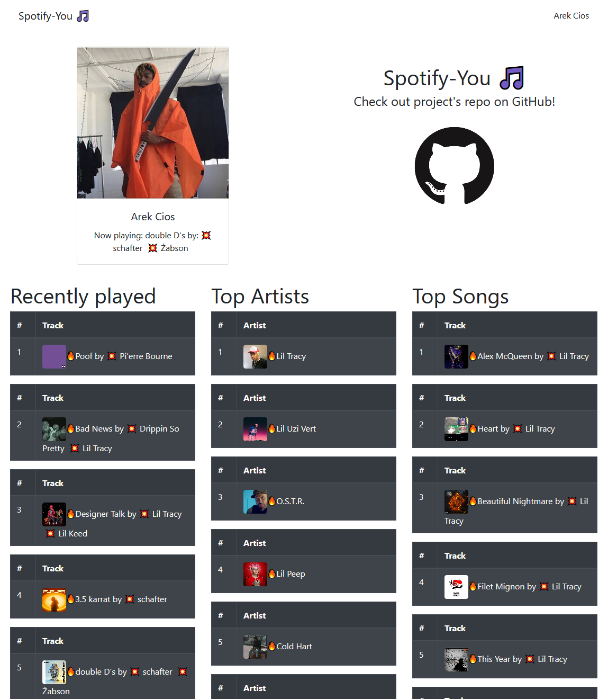

# spotify-you
Spotify listening stats web application, build in Next.js



## Contributing

1. Fork the Project
2. Create your Feature Branch (`git checkout -b feature/AmazingFeature`)
3. Commit your Changes (`git commit -m 'Add some AmazingFeature'`)
4. Push to the Branch (`git push origin feature/AmazingFeature`)
5. Open a Pull Request

## Getting Started

First, run the development server:

```bash
npm run dev
# or
yarn dev
```

Add .env.local file
```
touch .env.local
```
and add
```
client_secret={your_spotify_api_client_secret}
```

Open [http://localhost:3000](http://localhost:3000) with your browser to see the result.

## License

Distributed under the MIT License. See `LICENSE` for more information.
